## 1. 프로젝트 소개
<p align="center">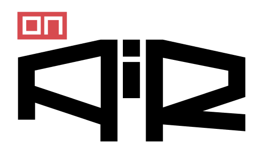</p>
- 스마트 글라스 기반 산업 현장 보조 시스템
- AR 작업지시·AI서포터·음성인터랙션을 결합한 원격/자율 작업 지원 시스템
- 주요 목표: 실시간 영상 인식, 설비 자동 판별, 이상탐지, AR 오버레이, Wakeword 기반 AI 지원

<p align="center">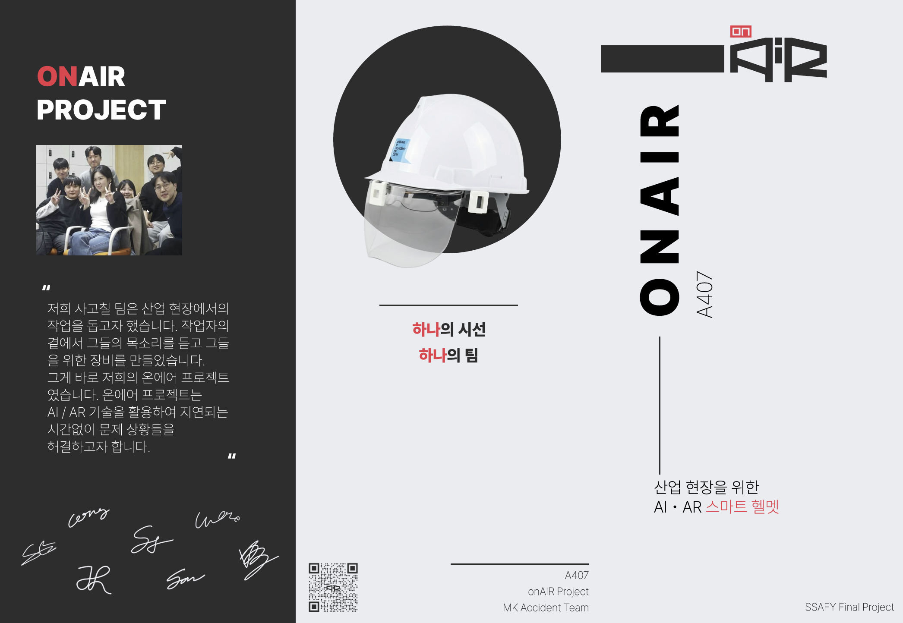</p>
<p align="center">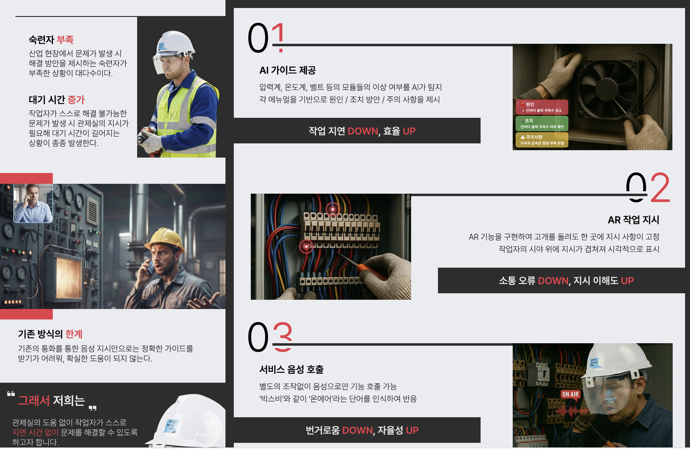</p>
<p align="center">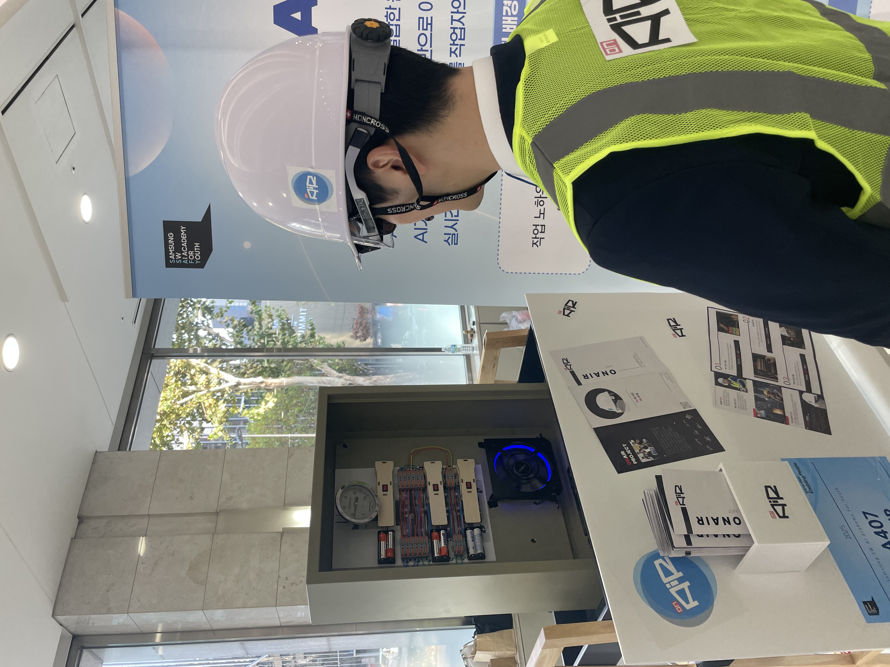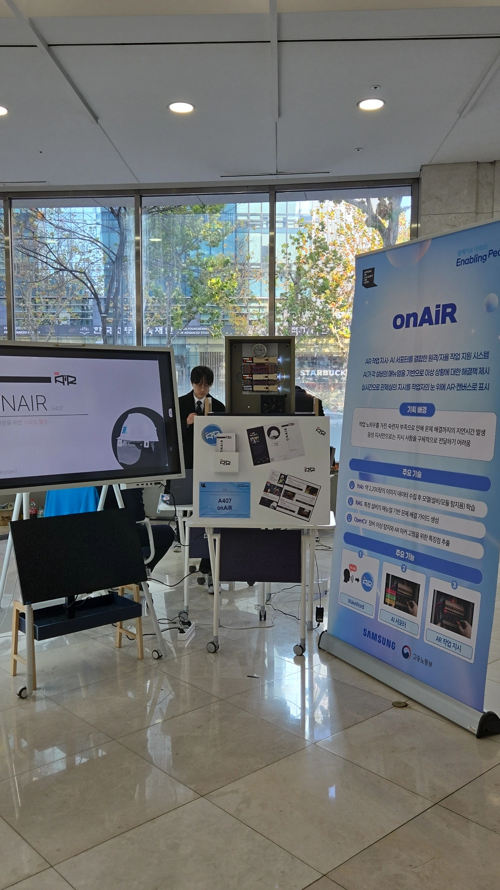


## 2. 문제 정의

- 현장 작업자의 안전, 경험 부족 문제
- 장비 규격 다양성, 육안 점검 한계
- 실시간 판단과 기록의 어려움
- 기존 시스템의 한계(수동 점검, 전문가 부재, 소통 불편함 등)

## 3. 프로젝트 미리보기

- YOLO 탐지
<p align="center"> 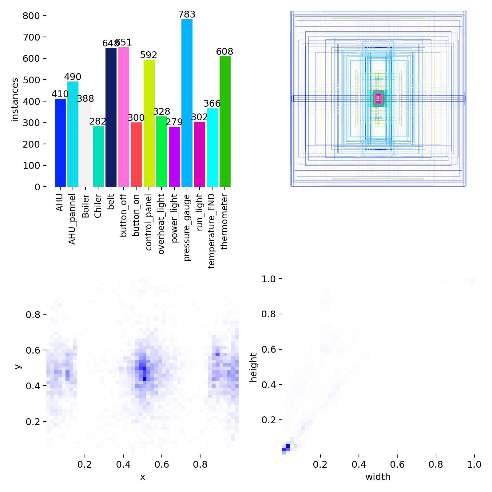 </p>
<p align="center"> 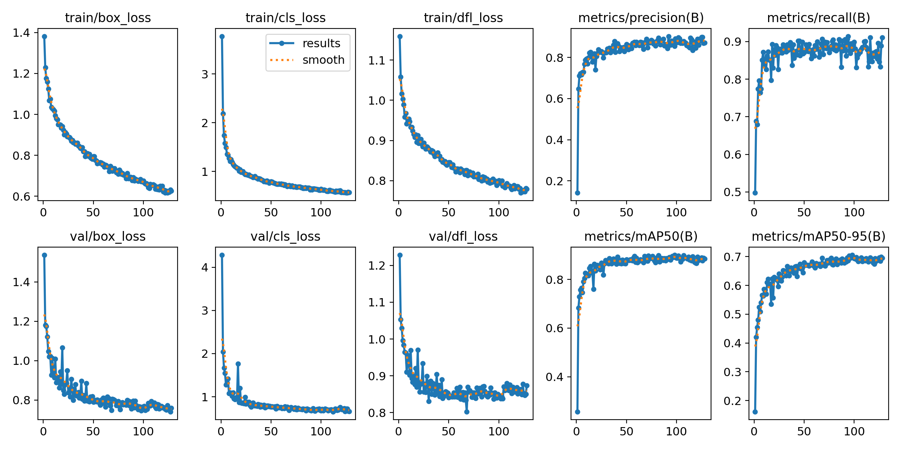 </p>

- 팬/벨트 이상탐지
<table>
  <tr>
    <td style="vertical-align: top; width: 50%;">
      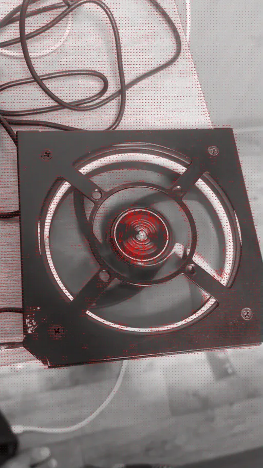
    </td>
    <td style="vertical-align: top; width: 50%;">
      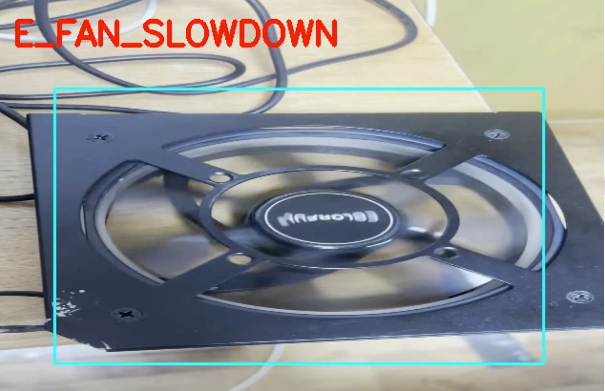
      <br/>
      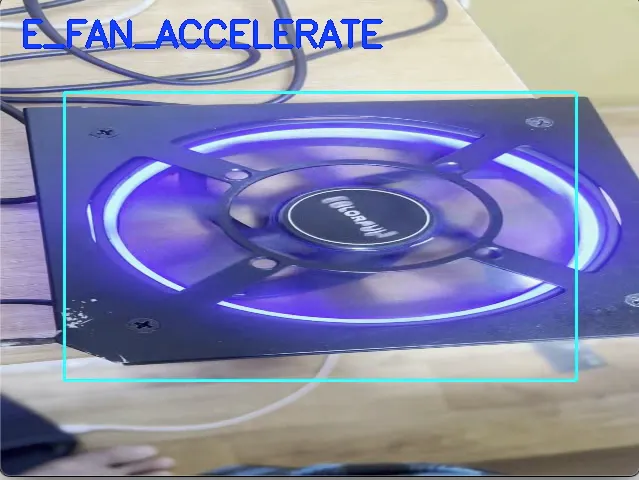
    </td>
  </tr>
</table>

- 게이지 자동 읽기
<p align="center"> 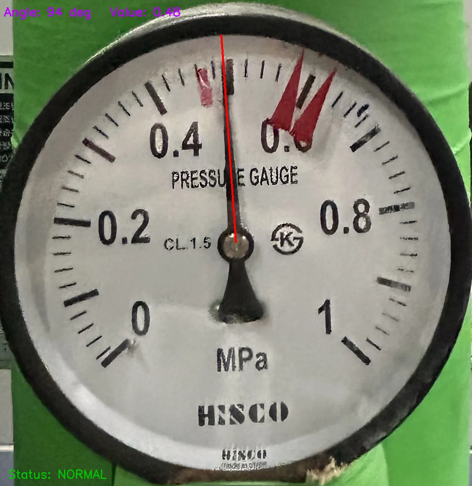 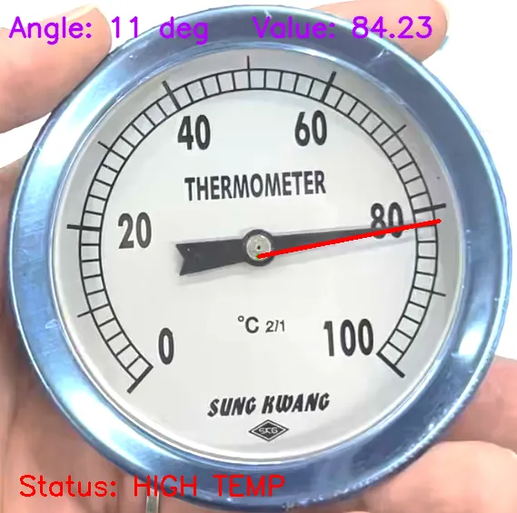 </p>

- 컨트롤 패널 점등 여부 확인
<p align="center"> 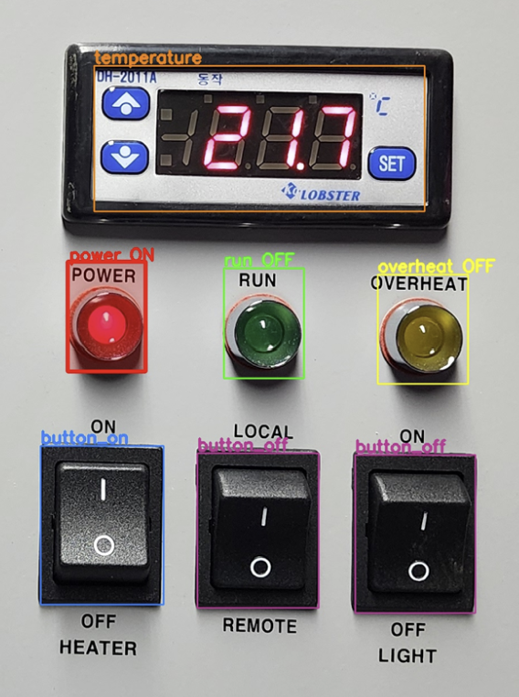 </p>
    
- AR 오버레이
<p align="center"> 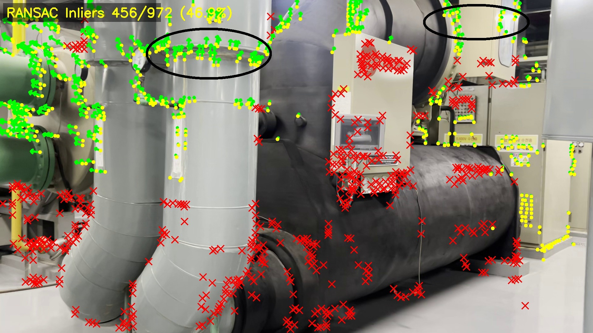 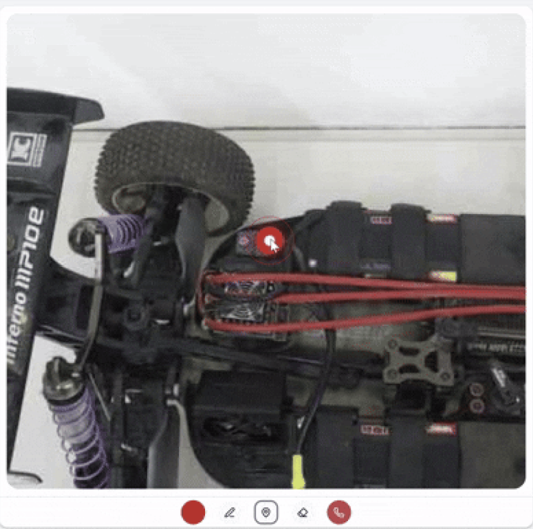 </p>
    

## 4. 주요 기능

1. 실시간 AR 협업 – 관제국이 현장 시야를 직접 보며 클릭만으로 즉시 시각적 지시 가능
2. AI 자율 지원 – 작업자가 오퍼레이터 도움 없이 AI 안내로 문제 해결 가능
3. 핸즈프리 인터랙션 – 음성 명령으로 손을 쓰지 않아도 조작 가능
4. 통합 관리 환경 – 근태·작업·이슈 현황을 한눈에 확인 가능한 관리자 대시보드

### 실시간 모듈 탐지

- AHU/Boiler/Chiller 자동 분류
- 팬/벨트/게이지/패널 탐지

### 이상탐지

- Optical Flow 기반 팬/벨트 진동 추정
- 게이지 바늘 이상(각도 추출)
- 패널 이상(불량 LED, 비정상 FND)

### 음성 기반 제어

- “ON AIR” Wakeword
- STT → AI → 가이드 생성
- 프론트/백엔드 통합 플로우

### AR 가이드

- 설비 인식 후 자동 매뉴얼 호출
- 주요 부품 강조
- 실시간 오버레이 텍스트

### 원격 지원

- WebRTC 기반 실시간 송출
- 소켓 기반 영상/데이터 전송

---

## 5. 기술 스택

### Backend

- FastAPI
- Spring Boot
- WebSocket / Socket.IO

### AI / CV

- YOLOv11
- Optical Flow (Farneback)
- Hough / warpPolar 게이지 추출
- STT & TTS

### Device / Embedded

- Raspberry Pi Zero 2W
- VoiceHAT
- Picamera2

### Infra

- Docker
- Redis
- EC2
- GitLab CI/CD

---

## 상세 기술 설명

## 1. 웨이크워드 인식 (TFLite CNN 모델)

작업자의 음성 중 "onAiR"라는 시동어를 실시간으로 감지하여 AI 서포터를 활성화하는 데 활용한다.

- **모델**: TensorFlow Lite 기반 경량 CNN 모델을 int8 양자화해 Raspberry Pi Zero 2W 환경에 최적화
- **입력**: 1초 단위의 오디오 스트림을 입력받아 'onAir' 여부를 예측
- **처리 과정**:
  - 마이크 스트림에서 오디오 청크 수집
  - MFCC 특징 추출
  - TFLite 모델로 추론 수행
  - 감지 시 STT 교차 검증으로 오탐지 방지

---

## 2. 음성 인식 (Cloud STT)

작업자의 발화를 인식해 텍스트로 변환, LLM 질의 입력으로 활용한다.

- **API**: Google Cloud Speech-to-Text API 사용
- **처리 과정**:
  - Wakeword 감지 후 STT 세션 시작
  - 버퍼링된 오디오 스트림을 GCP STT로 전송
  - 실시간 인식 결과 수신
  - 최종 텍스트를 의도 분류 및 RAG 질의로 전달

---

## 3. 음성 합성 (Text-to-Speech)

AI 서포터의 답변을 음성으로 변환해 작업자에게 즉각 피드백한다.

- **API**: Google Cloud Text-to-Speech API를 활용하여 자연스러운 한국어 음성 생성
- **처리 과정**:
  - GPT-4o 생성 답변 텍스트를 TTS 친화적 형식으로 변환
  - GCP TTS API 호출
  - Base64 인코딩된 오디오 생성
  - 모바일/PC로 전송하여 재생

---

## 4. 객체 및 모듈 인식 (YOLOv11-n 모델)

비디오 스트림에서 AHU, 팬, 벨트, 게이지 등 주요 장비와 모듈을 실시간으로 탐지한다.

- **모델**: YOLOv11 모델을 활용하여 현장 영상 프레임 내 장비·부품을 식별
- **처리 과정**:
  - OpenCV로 스트리밍 영상 처리
  - YOLO 추론 수행 (conf=0.75, iou=0.55)
  - 디바이스 타입 안정화 (5프레임 연속 감지 시 확정)
  - 모듈 박스 스무딩 처리 (게이지 제외)
  - 탐지 결과를 Redis에 저장
- **활용**: 탐지 결과는 이상 탐지 및 RAG 질의의 시각적 근거로 활용

---

## 5. 계기판 수치 분석 (OCR + Vision Processing)

계기판(게이지·디지털 패널)의 값을 자동으로 인식해 이상 여부를 판단한다.

- **기술**:
  - OpenCV와 Hough Transform을 활용해 바늘 위치 및 숫자 영역 검출
  - 각도 기반 값 변환 (온도계/압력계)
- **처리 과정**:
  - YOLO로 게이지 ROI 추출
  - Hough Circle Transform으로 원형 게이지 검출
  - 바늘 각도 계산 (0°~360°)
  - 각도 → 실제 값 변환 (온도: °C, 압력: MPa)
  - 기준 임계값과 비교하여 이상 탐지 수행
- **이상 판단 기준**:
  - 온도계: 40°C 초과 시 이상
  - 압력계: 0.8 초과 또는 0.2 미만 시 이상

---

## 6. 회전 감지 (Optical Flow 기반 분석)

팬이나 벨트 등 회전 부품의 동작 상태를 영상 흐름으로 분석하여 정상 동작 여부를 판별한다.

- **알고리즘**: OpenCV의 Farneback / Lucas-Kanade Optical Flow 알고리즘 활용
- **처리 과정**:
  - 30프레임 버퍼 수집
  - Fan/Belt ROI 영역에서 Optical Flow 계산
  - 프레임 간 움직임 벡터 계산
  - 회전 영역의 평균 흐름 방향·크기 분석
  - 정지 / 저속 / 정상 회전 상태로 분류
- **상태 분류**:
  - `E_NORMAL`: 정상 회전
  - `E_FAN_SLOWDOWN`: 감속 상태
  - `E_FAN_ACCELERATE`: 가속 상태
  - `E_FAN_VIBRATION`: 진동 상태

---

## 7. LLM 질의응답

작업자의 음성 질의(STT 결과)와 이미지 정보를 기반으로 절차 안내 및 트러블슈팅을 수행한다.

- **기술**: LangChain을 통한 RAG 검색 결과를 컨텍스트로 삽입하여 정확도 향상
- **처리 과정**:
  - STT 텍스트 + CV 탐지 결과를 기반으로 RAG 쿼리 생성
  - RAG 검색 결과를 컨텍스트로 포함
  - GPT-4o로 구조화된 답변 생성 (원인/조치/주의사항)
  - 요약형 마크다운 + 상세형 마크다운 생성
  - TTS 친화적 텍스트 생성

---

## 8. 문서 검색 및 RAG 엔진 (Sentence-Transformer + FAISS)

작업 매뉴얼·SOP 문서를 벡터화하여 AI 질의 시 근거를 실시간으로 검색한다.

- **기술**:
  - Sentence-Transformer를 사용해 문서 임베딩 생성
  - FAISS로 벡터 검색 구현
  - Hybrid Search (Dense + Sparse) 활용
- **처리 과정**:
  - Dense 검색: Sentence-Transformer 임베딩 기반 유사도 검색
  - Sparse 검색: BM25 기반 키워드 검색
  - Hybrid 점수 결합 (alpha=0.7)
  - Cross-Encoder Re-ranking 수행
  - 상위 5개 문서를 GPT-4o 컨텍스트로 제공
- **자동 확장**: 작업 로그를 주기적으로 요약·임베딩하여 지식베이스 자동 확장

---

## 9. AR 구현 (OpenCV 기반 Visual SLAM)

OpenCV를 활용한 Optical Flow 기반 Visual SLAM으로 실시간 카메라 모션 추정 및 3D 공간 좌표 계산을 수행한다.

### 9.1 카메라 보정 (Camera Calibration)

- **내부 파라미터 (Intrinsic Matrix)**: 
  - 카메라 내부 파라미터 행렬 K를 미리 보정하여 저장
  - 초점 거리 (fx, fy), 주점 (cx, cy) 포함
  - `camera_intrinsics.npy` 파일로 관리
- **보정 과정**:
  - 체스보드 패턴을 이용한 카메라 보정
  - 왜곡 계수 (distortion coefficients) 계산
  - 보정된 좌표 변환을 위한 파라미터 저장

### 9.2 특징점 추출 (Feature Extraction)

- **알고리즘**: 
  - **GFTT (Good Features to Track)**: 명암 대비가 충분한 장면에서 사용
  - **ORB (Oriented FAST and Rotated BRIEF)**: 저대비 장면에서 자동 fallback
- **처리 과정**:
  - CLAHE (Contrast Limited Adaptive Histogram Equalization) 명암 보정
  - Laplacian variance로 장면 대비 평가
  - 대비가 낮으면 ORB, 높으면 GFTT 선택
  - 최대 1200개 특징점 추출
  - GFTT 사용 시 sub-pixel refinement 수행
- **특징점 관리**:
  - 추적 실패 시 자동으로 새 특징점 추출
  - 최소 60개 특징점 유지

### 9.3 Optical Flow 추적 (Lucas-Kanade)

- **알고리즘**: 
  - Lucas-Kanade Optical Flow with Pyramid (L-K)
  - Forward-Backward 검증으로 추적 정확도 향상
- **처리 과정**:
  - 이전 프레임 특징점을 현재 프레임으로 추적 (Forward)
  - 현재 프레임 특징점을 이전 프레임으로 역추적 (Backward)
  - Forward-Backward 오차 계산
  - 오차가 임계값(1.0px) 이하인 특징점만 유효로 판단
  - 중앙값 기반 오차 필터링으로 이상치 제거
- **파라미터**:
  - 윈도우 크기: 21x21
  - 피라미드 레벨: 3
  - 최대 반복: 30

### 9.4 RANSAC 필터링

- **목적**: Optical Flow 대응점에서 이상치 제거
- **알고리즘**:
  - Fundamental Matrix 기반 RANSAC (일반적인 3D 장면)
  - Homography 기반 RANSAC (평면 장면, 인라이어 비율 80% 이상 시)
- **처리 과정**:
  - 카메라 보정을 통한 좌표 정규화
  - Fundamental Matrix와 Homography 동시 계산
  - 인라이어 비율 비교하여 적절한 모델 선택
  - 인라이어 부족 시 임계값 완화 후 재시도
  - 최종 인라이어만 Essential Matrix 계산에 사용

### 9.5 Essential Matrix 기반 모션 추정

- **목적**: 카메라의 회전(R)과 이동(t) 추정
- **알고리즘**:
  - Essential Matrix 계산 (RANSAC 기반)
  - SVD 분해를 통한 R, t 복원
  - Cheirality 검사 (3D 점이 카메라 앞에 있는지 확인)
- **처리 과정**:
  - 평균 시차(parallax) 계산 (최소 0.8px 필요)
  - Essential Matrix 계산 및 정규화
  - 4가지 가능한 R, t 조합 중 올바른 것 선택
  - Triangulation으로 3D 점 복원
  - Cheirality 비율 55% 이상인 조합 선택
  - 회전 행렬 누적: `R_total = R @ R_total`
  - 이동 벡터 누적: `t_total += R_total @ (t * SCALE_FACTOR)`
- **스무딩**: EMA 필터(alpha=0.1)로 좌표 안정화

### 9.6 깊이 추정 (Depth Proxy)

- **목적**: 상대적 깊이 정보 계산 (절대 깊이 불필요)
- **알고리즘**:
  - 패럴럭스(parallax) 기반 깊이 프록시 계산
  - FOE (Focus of Expansion) 기반 정규화
- **처리 과정**:
  - 회전 보정 후 순수 이동 패럴럭스 계산
  - FOE로부터의 거리로 정규화
  - Sparse depth map 생성
  - OpenCV inpaint로 Dense depth map 보간
  - 컬러맵 생성 (시각화용)

### 9.7 3D 좌표 변환 및 앵커 관리

- **목적**: 화면 클릭 위치를 3D 월드 좌표로 변환
- **처리 과정**:
  - 클릭 위치 (x, y) 수신
  - 가장 가까운 Optical Flow 벡터 탐색
  - Flow 벡터 길이로 깊이 추정: `z = (Z_ALPHA * f) / (flow_len + ε)`
  - 카메라 좌표계 변환: `cam_ray = inv(K) @ [x, y, 1] * z`
  - 월드 좌표계 변환: `world_point = inv(R_total) @ (cam_ray - t_total)`
  - 앵커 저장: {id, x, y, z, depth}
- **앵커 관리**:
  - 앵커 리스트 전역 관리
  - 프레임마다 앵커 위치 업데이트
  - 카메라 움직임에 따라 앵커 위치 자동 조정

### 9.8 화면 비율 변환 및 좌표 매핑

- **목적**: 카메라 좌표계와 프론트엔드 화면 좌표계 간 변환
- **카메라 해상도**: 480x360 (고정)
- **프론트엔드 화면**: 동적 크기 (컨테이너 크기에 따라 변경)
- **변환 과정**:
  - **카메라 → Stage**: 
    - 수평 크롭 계산 (종횡비 차이 보정)
    - 스케일 팩터 적용: `scale = stageHeight / CAMERA_HEIGHT`
    - 좌표 변환: `stageX = (cameraX / CAMERA_WIDTH) * scaledWidth - crop`
  - **Stage → 카메라**:
    - 역변환 수행
    - 경계값 클리핑 (0 ~ CAMERA_WIDTH/HEIGHT)

### 9.9 라벨·박스 렌더링

- **기술**: React Konva를 활용한 2D 캔버스 렌더링
- **렌더링 요소**:
  - **AR 마커**: 
    - 원형 마커 (Circle)
    - 펄스 효과 (Ripple animation)
    - 크기: 깊이 기반 동적 조정 (10px ~ 100px)
    - 색상: 모듈 타입별 구분
  - **YOLO 박스**: 
    - 탐지된 객체 바운딩 박스
    - 라벨 텍스트 (클래스명 + 신뢰도)
    - 이상 탐지 시 빨간색 강조
  - **게이지 값**: 
    - 온도/압력 수치 표시
    - 박스 하단에 텍스트 오버레이
- **효과**:
  - 펄스 애니메이션: 마커 크기 1.0 → 1.3, 투명도 0.5 → 0.0
  - 펜 그리기: 서서히 사라지는 효과 (opacity 감소)
  - 실시간 업데이트: Socket.IO 이벤트 기반

### 9.10 UI/UX 컨셉

- **실시간 피드백**:
  - AR 마커가 카메라 움직임에 따라 자연스럽게 추적
  - 이상 탐지 시 즉각 시각적 피드백
  - 펄스 효과로 사용자 주의 유도
- **직관적 인터페이스**:
  - 모듈별 색상 구분
  - 이상 상태 빨간색 강조
  - 깊이 기반 크기 조정으로 3D 공간감 제공
- **성능 최적화**:
  - 프레임별 처리 최적화
  - 정지 상태 감지 시 계산 생략
  - 특징점 자동 관리로 추적 안정성 확보

### 9.11 통신 프로토콜

- **서버 → 클라이언트**:
  - 이벤트: `ar-info`
  - 데이터: `{ markers: [{ type, idx, info: {x, y, size}, color, ... }] }`
  - 전송 주기: 비디오 프레임마다 (약 30fps)
- **클라이언트 → 서버**:
  - 이벤트: `ar-marker` (마커 생성 요청)
  - 데이터: `{ marker_x, marker_y, type, color, ... }`
- **좌표 시스템**:
  - 서버: 카메라 좌표계 (0 ~ 480, 0 ~ 360)
  - 클라이언트: Stage 좌표계 (동적 크기)
  - 변환: `convertCameraToStage()` 함수로 자동 변환

---

---

## 산출물

- 요구사항 정의서
    
    ## 1. 문서 정보
    
    | 항목    | 내용                            |
    | ----- | ----------------------------- |
    | 프로젝트명 | onAiR – AI 기반 산업 장비 정비 지원 시스템 |
    | 문서 버전 | 1.1                           |
    | 작성일   | 2024                          |
    | 작성자   | 개발팀                           |
    
    ---
    
    # 2. 프로젝트 개요
    
    ## 2.1 목적
    
    산업 현장에서 작업자가 장비 정비 업무를 수행할 때 발생하는
    **전문 지식 부족 · 오진단 · 장비 상태 판단 어려움** 등의 문제를 해결하기 위해
    AI 기반 음성/영상 분석과 AR 안내·원격 지원 기능을 제공하여 정비 효율과 정확성을 높이는 시스템을 구축한다.
    
    ## 2.2 범위
    
    본 시스템은 다음 기능을 포함한다:
    
    * 실시간 장비 및 구성 모듈 인식
    * 회전·계기판·LED 기반 이상 탐지
    * 음성 기반 AI 어시스턴트 (Wakeword / STT / TTS)
    * RAG + LLM 기반 정비 가이드 생성
    * AR 오버레이 안내 (장비 위치 및 절차 시각화)
    * 작업자 ↔ 관리자 간 실시간 원격 통신(WebRTC)
    * 사용자·장비·작업 로그 관리 기능
    
    ## 2.3 주요 이해관계자
    
    | 구분            | 역할                     |
    | ------------- | ---------------------- |
    | 작업자(End User) | 실제 장비를 정비하는 현장 기술자     |
    | 관리자(Operator) | 원격 모니터링·지원 및 사용자/장비 관리 |
    | 기업 관리자        | 시스템 활용 조직의 운영·관리 책임자   |
    | 개발팀           | 시스템 구축 및 유지보수 담당       |
    
    ---
    
    # 3. 사용자 역할 및 권한
    
    ## 3.1 사용자 유형
    
    | 역할  | 설명                           |
    | --- | ---------------------------- |
    | 관리자 | 사용자·장비 관리, 원격 통신 수락, 대시보드 조회 |
    | 작업자 | 현장에서 AI 서포터 활용 및 원격 통신 요청    |
    
    ## 3.2 권한 요약
    
    | 기능            | 관리자     | 작업자 |
    | ------------- | ------- | --- |
    | 로그인           | ✔       | ✔   |
    | 사용자/장비 관리     | ✔       | ✖   |
    | AI 서포터(음성·비전) | ✔       | ✔   |
    | 원격 통신 요청      | ✔       | ✔   |
    | 원격 통신 수락      | ✔       | ✖   |
    | 작업 로그 조회      | 제한적(전체) | 본인만 |
    
    ---
    
    # 4. 기능 요구사항
    
    ## 4.1 음성 기반 인터페이스
    
    ### FR-001: Wakeword 인식
    
    * **설명**: 작업자의 음성 중 “onAir” 발화 여부를 실시간 감지해 AI 서포터 활성화.
    * **요구사항**:
    
      * 시스템은 1초 단위의 오디오 버퍼를 분석해야 한다.
      * Wakeword 감지 실패 시 STT 모드로 전환되지 않는다.
      * 감지 후 3초간 STT 입력 대기 모드로 진입한다.
    
    ### FR-002: 음성 인식(STT)
    
    * **설명**: 작업자가 말한 문장을 텍스트로 변환하여 의도 분석 및 LLM 질의에 활용.
    * **요구사항**:
    
      * 시스템은 STT 결과를 intent 분석 모듈에 전달해야 한다.
      * 네트워크 장애 시 재시도 로직을 수행해야 한다.
    
    ### FR-003: 음성 합성(TTS)
    
    * **설명**: AI가 생성한 답변을 자연스러운 음성으로 변환하여 전달.
    * **요구사항**:
    
      * 작업자가 듣기 좋은 속도·톤으로 출력해야 한다.
      * TTS 생성 실패 시 텍스트로라도 사용자에게 제공해야 한다.
    
    ---
    
    ## 4.2 비전 기반 감지
    
    ### FR-010: 장비 인식
    
    * **설명**: 카메라 영상에서 AHU, Fan Unit 등 장비 전체를 탐지.
    * **요구사항**:
    
      * YOLO 기반 모델을 통해 장비의 위치와 유형을 식별해야 한다.
      * 동일 장비는 5프레임 이상 연속 탐지 시 확정된 것으로 간주한다.
    
    ### FR-011: 구성 모듈 인식
    
    * **설명**: Fan, Belt, Gauge, Panel 등 장비 구성 요소 탐지.
    * **요구사항**:
    
      * 장비 인식 후 해당 영역 내에서 모듈 탐지를 수행해야 한다.
      * 각 모듈은 Bounding Box 및 Confidence Score를 포함해야 한다.
    
    ---
    
    ## 4.3 이상 탐지
    
    ### FR-020: Fan/Belt 이상 탐지
    
    * **설명**: Optical Flow 기반으로 회전 정상/느림/정지 판단.
    * **요구사항**:
    
      * 시스템은 회전 벡터 크기·방향의 평균값을 분석해야 한다.
      * 기준 이하일 경우 “이상(감속 또는 정지)” 상태로 표시한다.
    
    ### FR-021: Gauge 이상 탐지
    
    * **설명**: 게이지 바늘 각도 또는 디지털값을 분석해 정상 범위 여부 판단.
    * **요구사항**:
    
      * ROI 내부에서 Hough Line/숫자 영역 탐지가 가능해야 한다.
      * 기준값 범위를 벗어난 경우 이상 상태로 전달한다.
    
    ### FR-022: Panel 이상 탐지
    
    * **설명**: LED 또는 버튼 상태로 패널 이상 여부 추론.
    * **요구사항**:
    
      * “ON/OFF”, “REMOTE/LOCAL”, “OVERHEAT” 등 정상 상태 대비 변화 탐지 가능해야 한다.
    
    ---
    
    ## 4.4 AI 정비 가이드
    
    ### FR-030: 문서 검색(RAG)
    
    * **설명**: 감지된 장비·이상 정보를 기반으로 가장 관련성 높은 문서를 검색.
    * **요구사항**:
    
      * 시스템은 Dense(FAISS) + Sparse(Elasticsearch) 검색 모두 수행해야 한다.
      * 검색 결과는 LLM에 전달하기 위한 형태로 정제해야 한다.
    
    ### FR-031: 정비 가이드 생성
    
    * **설명**: 원인 분석과 단계별 조치 가이드를 LLM이 생성.
    * **요구사항**:
    
      * 출력은 “요약/원인/조치/주의사항” 형태로 구조화해야 한다.
      * AR 오버레이 및 TTS용 표현을 함께 포함할 수 있어야 한다.
    
    ---
    
    ## 4.5 AR 오버레이
    
    ### FR-040: AR 마커 생성
    
    * **설명**: YOLO 박스, 클릭 위치 등을 기반으로 장비 또는 구성 요소의 AR 마커 생성.
    * **요구사항**:
    
      * 프레임 좌표계를 UI 화면에 맞게 변환해야 한다.
      * 모듈 위치가 변경되면 AR 마커도 실시간 갱신되어야 한다.
    
    ### FR-041: AR 안내 렌더링
    
    * **설명**: 절차 단계, 주의 표시 등을 화면에 시각적으로 오버레이.
    * **요구사항**:
    
      * 중요 구역은 강조(하이라이트) 처리되어야 한다.
      * 안내 단계 진행에 따라 마커 또는 라벨 색상·문구가 업데이트되어야 한다.
    
    ---
    
    ## 4.6 원격 통신
    
    ### FR-050: 통신 요청/수락
    
    * **설명**: 작업자가 관리자에게 원격 지원 요청을 보내고, 관리자가 응답.
    * **요구사항**:
    
      * 요청/응답 이벤트는 SSE 또는 WebSocket으로 실시간 전달되어야 한다.
    
    ### FR-051: WebRTC 통신
    
    * **설명**: 관리자–작업자 간 실시간 오디오·영상 통신.
    * **요구사항**:
    
      * LiveKit 기반 토큰을 생성해야 한다.
      * 끊김 발생 시 자동 재연결 시도해야 한다.
    
    ---
    
    ## 4.7 사용자/장비 관리
    
    ### FR-060: 사용자 관리
    
    * 생성/조회/수정/비활성화 기능 포함
    
    ### FR-061: 장비 관리
    
    * 장비 등록, 카테고리 분류, 이미지 업로드 기능 포함
    
    ---
    
    # 5. 비기능 요구사항
    
    ## 5.1 성능
    
    * 비전 처리: 실시간(약 30fps)
    * Wakeword → STT 전환: 1~2초 이내
    * LLM 응답: 5~10초 이내
    * API 응답: 500ms 이내 (일반 요청)
    
    ## 5.2 보안
    
    * JWT 기반 인증
    * HTTPS/TLS 1.3
    * 역할 기반 접근제어(RBAC)
    
    ## 5.3 가용성·안정성
    
    * 시스템 가동률 99%
    * 네트워크 단절 시 자동 재시도
    * 장애 발생 시 로그 기록 및 알림
    
    ## 5.4 확장성
    
    * 서비스 단위 독립 확장 가능
    * DB 인덱싱 및 캐싱(REDIS) 적용
    
    ---
    
    # 6. 시스템 아키텍처(요약)
    
    ```
    Web / Mobile / Raspberry Pi
            ↓
          API Gateway
            ↓
    Backend — AI Server — Vision Service
            ↓
    MySQL / Redis / Elasticsearch / FAISS
    ```
    
    ---
    
    # 7. 데이터 모델 (핵심)
    
    * User / UserAccount
    * Equipment / EquipmentCategory
    * Task
    * RefreshToken
    
    ---
    
    # 8. 인터페이스 요구사항
    
    * REST API: 인증, 사용자, 장비, WebRTC 요청
    * Socket.IO: 음성/영상 분석 이벤트
    * SSE: 원격 통신 요청 상태
    * 외부 API: Google Cloud STT/TTS, OpenAI GPT, LiveKit
    
    ---
    
    # 9. 제약사항 및 가정
    
    * Raspberry Pi Zero 2W 성능 제약 → 모델 경량화 필수
    * 현장 환경(조도/망 품질)에 성능 영향
    * Google Cloud 및 GPT 사용량 제한 존재
    
    
- ERD
    <p align="center"> 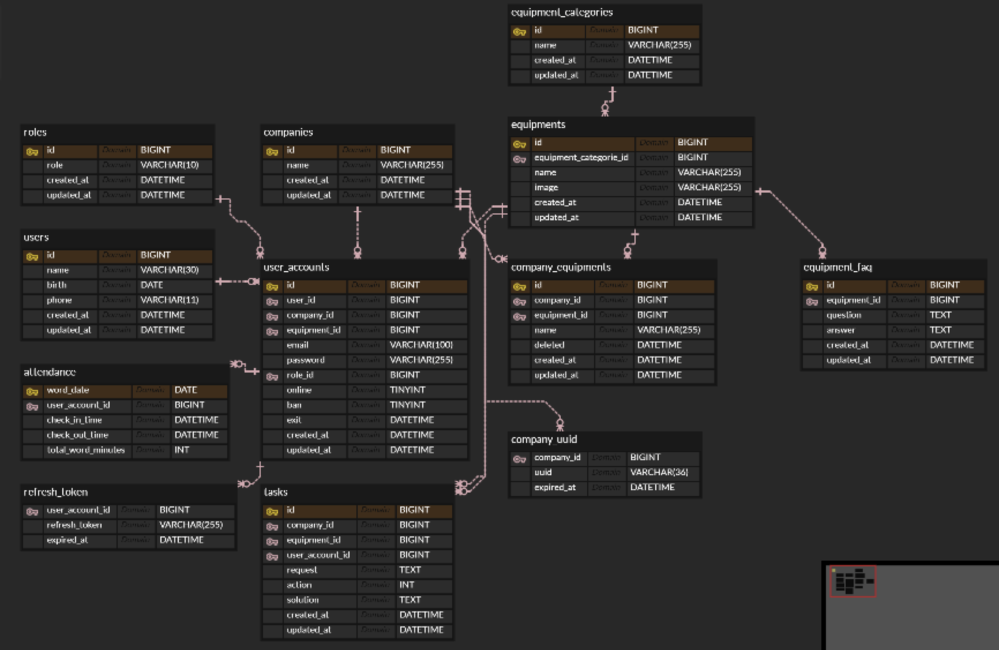 </p>
  
    
- API 설계
    
    # 🔗 BaseURL
    
    | 기능             | Path                                         | 설명              |
    | -------------- | -------------------------------------------- | --------------- |
    | BaseUrl        | —                                            | 기본 접근 주소입니다.    |
    | Spring Server  | `https://onair.ai.kr/api`                    | 메인 백엔드 서버 URL   |
    | FastAPI Server | `https://onair.ai.kr/ai`                     | FastAPI 서버 URL  |
    | **Socket URL** | `https://onair.ai.kr`<br>socketio-path=`/ws` | FastAPI 웹소켓 URL |
    
    ---
    
    # 👤 회원 관리
    
    | 기능             | Method | Path                          | Token | 설명                                                    |
    | -------------- | ------ | ----------------------------- | ----- | ----------------------------------------------------- |
    | 이메일 중복 확인      | POST   | `/auth/check/email`           | ❌     | 이메일 사용 가능 여부 확인                                       |
    | 비밀번호 유효성 검사    | POST   | `/auth/check/password`        | ❌     | 비밀번호 사용 가능 여부 확인                                      |
    | 회원가입 (관리자)     | POST   | `/auth/signup`                | ❌     | 회사 UUID 없이 회원가입 가능. `companyName` 포함 시 회사 생성 + 관리자 생성 |
    | 회원가입 (작업자)     | POST   | `/auth/signup?token={회사UUID}` | ❌     | 관리자에게 발급받은 회사 UUID 필요                                 |
    | 로그인            | POST   | `/auth/login`                 | ❌     | AccessToken, RefreshToken 발급                          |
    | 토큰 재발급         | POST   | `/auth/refresh`               | ❌     | RefreshToken으로 AccessToken 재발급                        |
    | 사용자 검증         | POST   | `/user/validation`            | ✔️    | 사용자 비밀번호를 입력받아 본인 확인                                  |
    | 사용자 정보 조회      | GET    | `/user/detail`                | ✔️    | 사용자 상세정보 조회                                           |
    | 사용자 정보 수정      | PATCH  | `/user/edit`                  | ✔️    | 사용자 정보 수정                                             |
    | 담당 설비 할당 (관리자) | PATCH  | `/user/equipment`             | ✔️    | 관리자만 접근. 작업자에게 설비 배정                                  |
    | 출근             | GET    | `/user/check/in`              | ✔️    | 출근 처리                                                 |
    | 퇴근             | GET    | `/user/check/out`             | ✔️    | 퇴근 처리                                                 |
    
    ---
    
    # 🏢 회사 관리
    
    | 기능             | Method | Path                            | Token | 설명              |
    | -------------- | ------ | ------------------------------- | ----- | --------------- |
    | 회사 UUID 발급     | GET    | `/company/token`                | ✔️    | 회사 UUID 발급      |
    | 소속 사원 조회 (관리자) | GET    | `/user/list?equipmentId={설비ID}` | ✔️    | 특정 설비 담당자 조회 가능 |
    
    ---
    
    # 🏭 설비 관리
    
    | 기능               | Method | Path                         | Token | 설명         |
    | ---------------- | ------ | ---------------------------- | ----- | ---------- |
    | 설비 카테고리 저장 (관리자) | POST   | `/equipment/category/regist` | ✔️    | 관리자만 접근 가능 |
    | 설비 저장 (관리자)      | POST   | `/equipment/regist`          | ✔️    | 관리자만 접근 가능 |
    | 설비 카테고리 조회       | GET    | `/equipment/category/list`   | ✔️    | 전체 카테고리 조회 |
    | 설비 조회            | GET    | `/equipment/list`            | ✔️    | 전체 설비 조회   |
    
    ---
    
    # 📝 작업 관리
    
    | 기능           | Method | Path                                        | Token | 설명             |
    | ------------ | ------ | ------------------------------------------- | ----- | -------------- |
    | 작업 등록 (관리자)  | POST   | `/task/regist`                              | ✔️    | 작업 생성          |
    | 작업 목록 조회     | GET    | `/task/list?equipmentId={설비ID}&action={상태}` | ✔️    | 생성된 작업 조회      |
    | 작업 할당        | PATCH  | `/task/assign`                              | ✔️    | 작업자에게 작업 할당 요청 |
    | 작업 재할당 (관리자) | PATCH  | `/task/assign/re`                           | ✔️    | 다른 작업자에게 재배정   |
    | 작업 완료 처리     | PATCH  | `/task/end`                                 | ✔️    | 작업 완료          |
    | 작업 취소 처리     | PATCH  | `/task/cancel`                              | ✔️    | 작업 취소          |
    
    ---
    
    # 🔄 작업 실시간 관리 (SSE)
    
    | 기능           | Method | Path           | Token | 설명                |
    | ------------ | ------ | -------------- | ----- | ----------------- |
    | SSE 연결 (최신)  | GET    | `/sse/stream`  | ✔️    | 최신 작업의 실시간 현황 스트림 |
    | SSE 연결 (구버전) | GET    | `/task/stream` | ✔️    | 이전 버전 SSE 스트림     |
    
    ---
    
    # 📞 오퍼레이터 실시간 통신
    
    | 기능                      | Method | Path                                  | Token | 설명                               |
    | ----------------------- | ------ | ------------------------------------- | ----- | -------------------------------- |
    | Livekit Access Token 발급 | GET    | `/webrtc/create-token?roomName=<방이름>` | ✔️    | livekit cloud 접속용 토큰 (테스트용)      |
    | 실시간 통신 요청               | POST   | `/webrtc/request`                     | ✔️    | 상대에게 실시간 통신 요청                   |
    | 실시간 통신 응답               | POST   | `/webrtc/response`                    | ✔️    | 통신 요청에 대한 응답                     |
    | 관전자 토큰 발급               | GET    | `/webrtc/get-join-token`              | ❌     | 관리자/작업자가 통신 중인 방에 입장할 수 있는 토큰 발급 |
    

    

---

## 팀 소개

박소정 : BE/AI

최선우 : FE/EM

이병헌 : AI/BE

김나영 : MO/AR

박재환 : BE/AR

손동현 : EM/FE

김준혁 : BE/INF